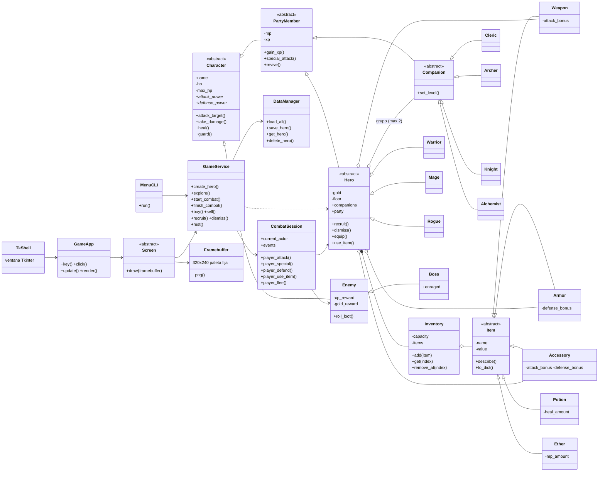

# Arquitectura — Pixel-Quest

## Dependencias entre capas
`ui  →  services  →  domain` (nunca al revés).

## Contenido como datos
`src/services/content.py` guarda enemigos, jefes, tienda y taberna como listas: agregar contenido no toca la lógica.

## Interfaz gráfica (`src/ui/gui/`)
El juego se dibuja en un **framebuffer de 320x240 con paleta fija** (como una consola de 8 bits) y se
amplía al mostrarlo. Solo `tk_shell.py` usa Tkinter; `GameApp` recibe teclas/clics y dibuja, por eso se
prueba sin ventana.

| Archivo | Qué hace |
|---------|----------|
| `palette.py`, `font.py` | Colores y fuente bitmap 5x7 (con tildes y Ñ) |
| `framebuffer.py` | Dibujar rectángulos, sprites, texto y exportar a PNG |
| `sprites.py` | Pixel-art de héroes, compañeros, enemigos, jefes e iconos |
| `backgrounds.py` | Campamento, título y mazmorra (5 temas por piso) |
| `widgets.py` | Ventanas azules, barras, menús con cursor y diálogos con máquina de escribir |
| `screens_menu.py` | Título, crear héroe, cargar/borrar |
| `screens_camp.py` | Campamento, exploración, inventario, tienda, taberna, estado |
| `screens_combat.py` | Combate en grupo con animaciones |
| `sound.py` | Efectos de sonido de ondas cuadradas generados por código |
| `app.py`, `tk_shell.py` | Controlador sin ventana / ventana Tkinter |
